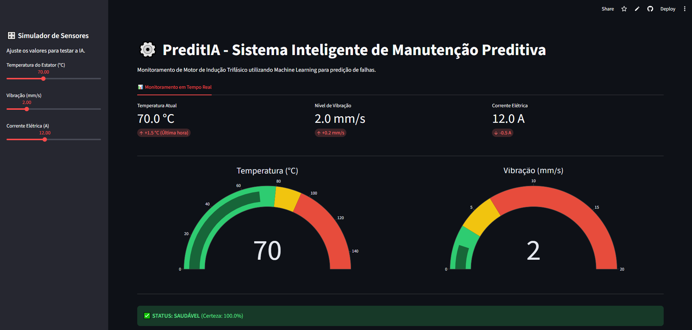

# ⚙️ PreditIA: Sistema Inteligente de Manutenção Preditiva



O **PreditIA** é uma solução de Monitoramento Industrial 4.0 que utiliza Machine Learning para diagnosticar a saúde de motores de indução trifásicos em tempo real. O projeto simula o ciclo completo de um engenheiro de dados: desde a geração de sinais ruidosos até a implementação de um dashboard preditivo.

## 🚀 Funcionalidades

- **Monitoramento em Tempo Real:** Interface interativa para ajuste de parâmetros de Temperatura, Vibração e Corrente.
- **Diagnóstico com IA:** Classificação instantânea do estado do motor (*Saudável*, *Alerta* ou *Falha*) com cálculo de nível de certeza.
- **Pipeline de Dados Robusto:** Tratamento automático de falhas de sensores, outliers e despadronização de dados.
- **Visualização Industrial:** Gráficos de Gauge (velocímetros) e métricas dinâmicas para fácil interpretação.

## 🛠️ Tecnologias Utilizadas

- **Linguagem:** Python 3.11
- **Bibliotecas de Dados:** Pandas, NumPy
- **Machine Learning:** Scikit-Learn (Random Forest Classifier)
- **Interface Gráfica:** Streamlit
- **Visualização:** Plotly
- **Serialização:** Joblib

## 📁 Estrutura do Projeto

* `gerador.py`: Cria dados sintéticos baseados em distribuições normais, simulando três fases de operação e injetando "caos" (erros de leitura e NaNs).
* `tratamento_dados.py`: Realiza a limpeza dos dados brutos, corrige tipos de variáveis, trata outliers e rotula os dados conforme normas técnicas.
* `machine_learning.py`: Treina o modelo Random Forest e exporta o "cérebro" do sistema (`.pkl`).
* `app.py`: O painel de controle interativo construído em Streamlit.
* `preditia.bat`: Script de inicialização rápida para Windows.
* `requirements.txt`: Lista de dependências para instalação do ambiente.

## 📈 Lógica de Diagnóstico (Critérios Técnicos)

O sistema baseia-se em heurísticas de engenharia mecatrônica para a rotulagem:

| Parâmetro | Saudável | Alerta | Falha (Risco) |
| :--- | :--- | :--- | :--- |
| **Temperatura** | < 80°C | 80°C - 95°C | > 95°C |
| **Vibração** | < 3.5 mm/s | 3.5 - 6.5 mm/s | > 6.5 mm/s |
| **Corrente** | < 15A | 15A - 17.25A | > 17.25A |

## 🔧 Como Executar

### Pré-requisitos
Certifique-se de ter o Python instalado em sua máquina e todas as bibliotecas necessárias.
- **Linguagem:** Python 3.11
- **Bibliotecas de Dados:** Pandas, NumPy
- **Machine Learning:** Scikit-Learn (Random Forest Classifier)
- **Interface Gráfica:** Streamlit
- **Visualização:** Plotly
- **Serialização:** Joblib

### Execução
* É possivel acessar a aplicação de duas formas


## 🚀 Diretamente na Web:
   Acesse diretamente pelo site https://preditia-monitoramento.streamlit.app/


## 🚀 Como rodar localmente:
Clone este repositório.
   No Windows, basta executar o arquivo `preditia.bat`.

Caso seja optado em realizar uma execução mais manual, garanta que todos os arquivos estejam em uma mesma pasta. Com isso, siga os seguintes passos:
1. Instale as bibliotecas: `pip install -r requirements.txt`  # Caso não tenhsa sido instalado
2. Gere os dados: `python gerador.py`
3. Trate os dados: `python tratamento_dados.py`
4. Treine a IA: `python machine_learning.py`
5. Execute o App: `streamlit run app.py`
   
   
   
**Ou via terminal:**
```bash
pip install -r requirementes.txt
streamlit run app.py
